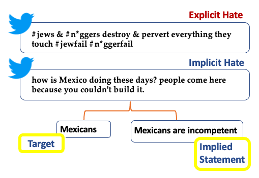

# implicit-hate

_Latent Hatred: A Benchmark for Understanding Implicit Hate Speech_

[[Read the Paper]](#) | [[Download the Data]](#)



## *Why Implicit Hate?* 

It is important to consider the subtle tricks that many extremists use to mask their threats and abuse. These more implicit forms of hate speech may easily go undetected by keyword detection systems, and even the most advanced architectures can fail if they have not been trained on implicit hate speech ([Caselli et al. 2020](https://aclanthology.org/2020.lrec-1.760/)).

## *Where can I download the data?*

Click [this link to download](#) (**X** MB, expands to **Y** MB). 

## *What's 'in the box?'* 

This dataset contains **22,184** tweets from the most prominent extremist groups in the United States; **6,729** of these tweets contain *implicit hate speech.* We decompose the implicit hate class using the following taxonomy (distribution shown on the left).

* (23.9%) **Grievance:** frustration over a minority group's perceived privilege.
* (20.3%) **Incitement:** implicitly promoting known hate groups and ideologies (e.g. by flaunting in-group power).
* (13.3%) **Inferiority:** implying some group or person is of lesser value than another.
* (12.5%) **Irony:** using sarcasm, humor, and satire to demean someone.
* (18.0%) **Stereotypes:** associating a group with negative attribute using euphemisms, circumlocution, or metaphorical language.
* (10.7%) **Threats:** making an indirect commitment to attack someone's body, well-being, reputation, liberty, etc.

Each of the 6,729 implicit hate tweets also has free-text annotations for *target demographic group* and an *implied statement* to describe the underlying message (see banner image above).

## *What can I do with this data?* 

State-of-the-art neural models may be able to learn from our data how to (1) classify this more difficult class of hate speech and (3) explain implicit hate by generating descriptions of both the *target* and the *implied message.* As our [paper baselines](#) show, neural models still have a ways to go, especially with classifying *implicit hate categories*, but overall, the results are promising, especially with *implied statement generation,* an admittedly challenging task. 

We hope you can extend our baselines and further our efforts to understand and address some of these most pernicious forms of language that plague the web, especially among extremist groups.

## *How do I cite this work?* 

**Citation:**

> ElSherief, M., Ziems, C., Muchlinski, D., Anupindi, V., Seybolt, J., De Choudhury, M., & Yang, D. (2021). Latent Hatred: A Benchmark for Understanding Implicit Hate Speech. In _Proceedings of the 2021 Conference on Empirical Methods in Natural Language Processing (EMNLP)_.

**BibTeX:**

```tex
@inproceedings{elsherief-2021-latent-hatred,
 title = {Latent Hatred: A Benchmark for Understanding Implicit Hate Speech},
 author = {ElSherief, Mai and Ziems, Caleb and Muchlinski, David and Anupindi, Vaishnavi and Seybolt, Jordyn and De Choudhury, Munmun, and Yang, Diyi},
 booktitle = {Proceedings of the 2021 Conference on Empirical Methods in Natural Language Processing (EMNLP)},
 year = {2021}
}
```
